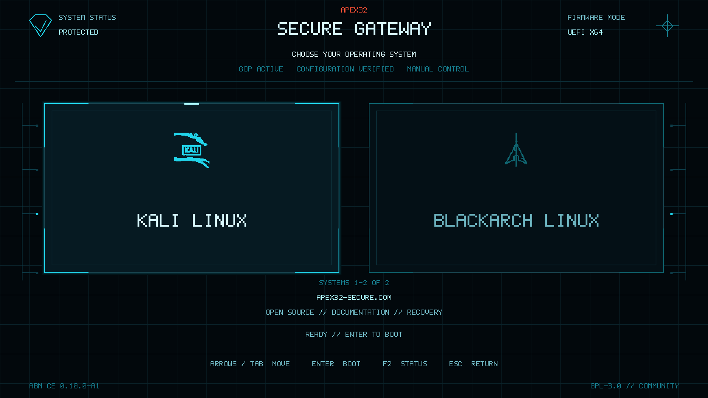

# APEX32 Boot Manager Community Edition

[](https://github.com/32oeb32/APEX32-BootManager/actions/workflows/host-smoke.yml)
[](https://github.com/32oeb32/APEX32-BootManager/actions/workflows/ovmf-visual-smoke.yml)
[](https://github.com/32oeb32/APEX32-BootManager/actions/workflows/linux-package.yml)
[](https://github.com/32oeb32/APEX32-BootManager/actions/workflows/windows-package.yml)

APEX32 is a native graphical x86_64 UEFI boot manager written in freestanding
C++20 with EDK II and the Graphics Output Protocol. It is an independent boot
manager—not a GRUB or rEFInd theme.

It discovers approved EFI loaders, presents them as scalable operating-system
cards, and transfers control through UEFI. Linux and Windows installers use
transactional backups, verified firmware, automatic rollback, and graphical
recovery.

- **Project website:** [apex32-secure.com](https://apex32-secure.com)
- **License:** [GPL-3.0](LICENSE)
- **Current milestone:** `v0.11.0-beta1` release candidate



## Install APEX32

| Platform | User experience | Current availability |
|---|---|---|
| Kali, Debian, Ubuntu | One verified command or a downloadable `.deb`, followed by the graphical installer | Physical Kali qualification passed; public beta asset pending final release publication |
| Windows 10/11 x64 | Download one Setup executable, approve UAC, then use the graphical installer | Package and CI complete; Windows VM and physical qualification still required |

### Kali Linux

After the public beta release is published, a Kali user can run:

```bash
git clone https://github.com/32oeb32/APEX32-BootManager.git && cd APEX32-BootManager && ./install.sh
```

The launcher downloads the tested Debian package from the latest GitHub
release, verifies its SHA-256, requests graphical PolicyKit authorization,
installs the package, and opens the GUI. It does not compile EDK II or ask the
user to edit the ESP or firmware variables.

Continue with the complete [Kali installation and recovery guide](Docs/INSTALL_KALI.md).

### Windows

Windows users will download and double-click:

```text
APEX32-Community-Setup.exe
```

The setup package contains the same verified EFI application as Linux. The GUI
uses standard UAC, temporarily mounts the Windows system ESP, and performs
scan, installation, make-default, and restore without PowerShell or Command
Prompt.

The Windows package is **not yet approved for physical end-user installation**.
Complete the [Windows installation and recovery guide](Docs/INSTALL_WINDOWS.md)
only after a qualified beta release is published.

## What the graphical installer does

1. Scans the selected EFI System Partition for bootable EFI applications.
2. Lets the user choose which operating systems appear in APEX32.
3. Verifies the packaged APEX32 firmware.
4. Saves the previous firmware files and exact UEFI boot order.
5. Installs one APEX32 entry and promotes it to the first boot position.
6. Reads the result back and reports success or automatically rolls back.
7. Provides graphical **Recovery / Restore Previous Boot Manager**.

Installing the desktop package alone does not modify the ESP or `BootOrder`.
Only the user's explicit **Install APEX32 and Make Default** action starts the
privileged transaction.

## Firmware experience

- approved APEX32 Secure intro with no countdown or automatic boot;
- resolution-independent GOP renderer with centered letterboxing;
- dynamic one-to-32-card layout and keyboard navigation;
- identities for Kali, BlackArch, Windows, Ubuntu, Fedora, Arch, Debian,
  Linux Mint, openSUSE, Pop!_OS, OpenCore, recovery, USB, and network loaders;
- a generic card for unknown EFI loaders;
- installer-selected configurations remain authoritative;
- same-ESP loader verification before handoff; and
- F2 read-only diagnostics.

Unknown loaders remain bootable and do not require source-code changes.

## Current qualification status

The corrected Linux candidate passed physical testing on an HP Victus running
Kali/Hyprland:

- graphical authorization and scan;
- Kali and BlackArch selection only;
- transactional installation and make-default;
- approved intro and exactly two selected cards;
- successful Kali and BlackArch handoffs; and
- graphical recovery followed by a normal Kali boot.

Windows packaging, native `Boot####` transactions, multi-ESP identity guards,
and isolated rollback tests pass in CI. Before Windows publication, the exact
package must still pass a snapshot-backed Windows UEFI VM and a physical
Windows machine. The Community beta is unsigned and refuses installation when
Secure Boot is enabled.

See [Hardware qualification](Docs/HARDWARE_QUALIFICATION.md) for the evidence
and remaining gates.

## Safety requirements

Before installing a beta:

- use an x86_64 computer booted in UEFI mode;
- keep recovery media and a known-good direct OS boot entry;
- disable Secure Boot for the unsigned Community beta;
- select only loaders that belong to the ESP being installed; and
- use graphical Recovery before removing the desktop package.

APEX32 never asks release users to manually copy EFI files, edit GRUB, run
`efibootmgr`, use BCDEdit, or assign a Windows ESP drive letter.

Read the [Installer security model](Docs/INSTALLER_SECURITY.md) before hardware
qualification or packaging work.

## Documentation

### Users

- [Kali installation and recovery](Docs/INSTALL_KALI.md)
- [Windows installation and recovery](Docs/INSTALL_WINDOWS.md)
- [One-step installation design](Docs/ONE_STEP_INSTALL.md)
- [Hardware qualification](Docs/HARDWARE_QUALIFICATION.md)
- [Troubleshooting and installer testing](Docs/INSTALLER_TESTING.md)

### Contributors

- [Architecture](Docs/ARCHITECTURE.md)
- [Graphics foundation](Docs/GRAPHICS_FOUNDATION.md)
- [Native UEFI discovery](Docs/NATIVE_BOOT_DISCOVERY.md)
- [Configuration format](Docs/CONFIG_FORMAT.md)
- [QEMU/OVMF testing](Docs/QEMU_OVMF_TESTING.md)
- [Linux packaging](Docs/LINUX_PACKAGE.md)
- [Windows production installer](Docs/WINDOWS_PRODUCTION_INSTALLER.md)
- [Roadmap](Docs/ROADMAP.md)

## Build and test from source

Source builds are for contributors and intentionally remain unable to modify
real hardware unless packaging explicitly supplies a verified EFI artifact.

```bash
./Tools/test-host.sh

EDK2_DIR=/path/to/edk2 \
  ./Tools/build-edk2.sh
```

The EFI output is:

```text
Build/DEBUG_GCC/X64/Apex32BootManager.efi
```

Run it only in disposable QEMU/OVMF test environments described in
[QEMU/OVMF testing](Docs/QEMU_OVMF_TESTING.md).

## Repository layout

- `BootManager/` — UEFI application entry and lifecycle
- `Renderer/`, `Animation/`, `Fonts/`, `Themes/` — graphical firmware UI
- `Config/` — bounded installer-generated boot configuration
- `Boot/` — discovery, device-path validation, and handoff
- `Menu/` — dynamic cards, navigation, and interactions
- `Assets/` — firmware-safe emblem and OS identity registry
- `Installer/Linux/` — Qt GUI and PolicyKit helper
- `Installer/Windows/` — Qt GUI, UAC flow, and native transaction backend
- `Tests/` — host, package, firmware-variable, and framebuffer tests
- `Docs/` — architecture, security, qualification, and user guides

## License and trademarks

Copyright (C) 2026 Oussama / APEX32 Secure contributors.

APEX32 is free software under the [GNU General Public License v3.0](LICENSE)
and is provided **without warranty** as described by GPL-3.0 sections 15 and
16. Firmware and boot-order changes carry inherent risk.

Kali, BlackArch, Windows, Linux, UEFI, and other names or marks remain the
property of their respective owners. Their appearance identifies compatible
boot targets and does not imply endorsement.
